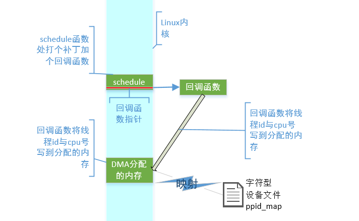
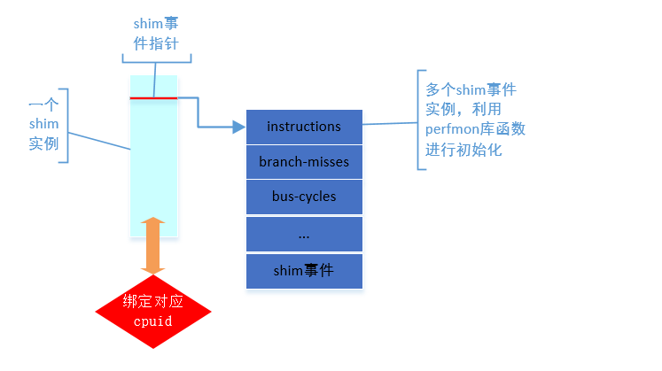
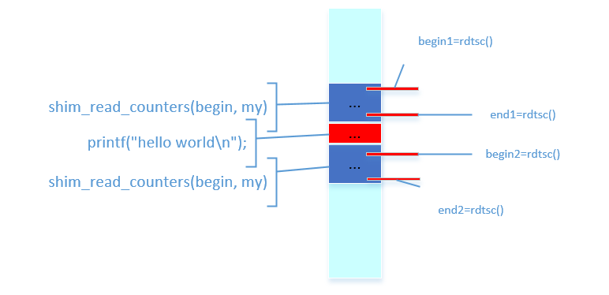

文章主要是关于细粒度高频率观测程序性能，作者yangxi，[文章和实验代码](https://github.com/yangxi/SHIM)均可以在github上找到 。一般的程序性能观测采样是采用的linux的perf模块，但是perf只能观测较为宏观的程序性能参数，如果进行高频度的观测，观测程序就会对被观测程序进行影响，而这篇文章中的shim正是为解决这个问题而存在的。而shim之所以能在elfen论文中被使用也正是因为其高频度的准确观测程序数据，这一点使得其能够高频度观测到cpu空闲的区间，进而被elfen所用。

实验代码主要包括两个部分，一个是一个linux内核模块ppid_module，另一个是shim的核心代码。文章中的实验数据是对一个java模拟器进行性能观测，这里我仅对ppid_module和shim的两个简单使用例子进行说明。

## ppid 内核模块

这个模块的主要作用是任何时候显示哪个线程跑在哪个cpu上，主要方式是允许一个用户程序映射一段无cache的连续物理内存缓冲区，ppid主要的工作在初始化和映射，以及一个额外的在内核中schedule处被调用的一个回调函数



### 回调函数
回调函数主要就是在内核的schedule函数结尾处加了个指针，指向我们将在初始化时指定的函数，该函数主要功能为获取下一个要执行的线程的id及cpu的编号，并一起存入初始化时分配的内存中。因为要对schedule函数进行改动，所以利用如下补丁对linux源码进行改动，改动完后需要重新编译内核源码安装，并选择对应内核重新启动
```c
diff --git a/kernel/sched/core.c b/kernel/sched/core.c
index 649c9f8..e5a02fd 100644
--- a/kernel/sched/core.c
+++ b/kernel/sched/core.c
@@ -3365,6 +3365,9 @@ pick_next_task(struct rq *rq)
 	BUG(); /* the idle class will always have a runnable task */
 }

+void (*switchCallBack)(struct task_struct *prev,struct task_struct *next) = NULL;
+EXPORT_SYMBOL(switchCallBack);
+
 /*
 * __schedule() is the main scheduler function.
 */
@@ -3445,6 +3448,9 @@ need_resched:
 	sched_preempt_enable_no_resched();
 	if (need_resched())
 		goto need_resched;
+
+	if (switchCallBack)
+	 switchCallBack(prev,next);
 }

 static inline void sched_submit_work(struct task_struct *tsk)
```

### 模块初始化 ppid_map_init

ppid模块初始化的过程中，主要利用了 dma_alloc_coherent 函数分配了一段无cache的连续内存，dma_alloc_coherent这个函数本来是为DMA设备进行内存分配的，在被调用时实际上是会返回两个值
* 函数的返回值，void *类型，代表缓冲区的内核虚拟地址
* dma_handle保存相关的总线地址，即物理地址，为DMA设备所用

然后是需要创建一个字符设备文件`/dev/ppid_map`,在初始化过程中这个字符设备会加如内核中，并在之后的映射过程与分配的无cache内存进行关联。 手动创建shell脚本如下
```perl
#!/bin/bash
if [ -a /dev/ppid_map ]
 then
  echo "/dev/ppid_map is exist already."
  exit
fi

deviceID=`cat /proc/devices | grep ppid | grep -o [0-9]*`
echo $deviceID
mknod /dev/ppid_map c $deviceID 0
ls -lh /dev/ppid_map
```

### 文件操作映射过程 .mmap = mmap_mmap

映射过程主要利用dma_mmap_coherent函数将分配的dma无cache内存区域与用户进程的虚拟内存块vma进行挂钩，使得用户进程能对分配的内存进行访问

### example
如下为一个ppid模块的测试程序
```c
/**
 * ppid_test.c
 */
#include <stdio.h>
#include <unistd.h>
#include <sys/mman.h>
#include <sys/types.h>
#include <sys/stat.h>
#include <fcntl.h>
#include <stdlib.h>

#define NPAGES 1

int main(void)
{
	int fd;
 int *kadr;
	int len = NPAGES * getpagesize();

	if ((fd=open("/dev/ppid_map", O_RDWR|O_SYNC)) < 0) {
		perror("open");
		exit(-1);
	}
	fprintf(stderr, "/dev/ppid_map: open OK\n");

	kadr = mmap(0, len, PROT_READ|PROT_WRITE, MAP_SHARED| MAP_LOCKED, fd, 0);

	if (kadr == MAP_FAILED)	{
		perror("Could not mmap /dev/ppid_map");
		exit(-1);
	}
	fprintf(stderr, "ppid_map: mmap OK\n");

	int cpu = 0;
	while(1){
	 for (cpu=0; cpu<8; cpu++){
	  int *buf = kadr + cpu * (64/sizeof(int));
	  printf("CPU%d: tgid %d pid %d\n", cpu, buf[0], buf[1]);
	 }
	 sleep(1);
	}
	close(fd);
	return(0);
}
```
下面，为输出结果，由于测试平台为intel 双核四线程cpu，故只输出了cpu0到cpu3的结果，结果为线程与cpu号的一一对应
```perl
/dev/ppid_map: open OK
ppid_map: mmap OK
CPU0: tgid 238 pid 238
CPU1: tgid 5774 pid 5774
CPU2: tgid 0 pid 0
CPU3: tgid 0 pid 0
CPU4: tgid -1 pid -1
CPU5: tgid -1 pid -1
CPU6: tgid -1 pid -1
CPU7: tgid -1 pid -1
CPU0: tgid 7 pid 7
CPU1: tgid 5774 pid 5774
CPU2: tgid 1878 pid 1878
CPU3: tgid 0 pid 0
CPU4: tgid -1 pid -1
CPU5: tgid -1 pid -1
CPU6: tgid -1 pid -1
CPU7: tgid -1 pid -1
...
```

## shim 核心代码
主要数据结构如下
```c
struct shim_hardware_event {
 int index;
 int fd;
 struct perf_event_attr perf_attr;
 struct perf_event_mmap_page *buf;
 char * name;
};

typedef struct shim_worker_struct shim;

struct shim_worker_struct{
 int cpuid;
 int nr_hw_events;
 struct shim_hardware_event *hw_events;
 int (*probe_other_events)(uint64_t *buf, shim *myshim);
 int (*probe_tags)(uint64_t *buf, shim * myshim);
};
```



作者在shim中提供了一些基本的函数，如relax_cpu释放cpu控制权，作用相当于机器指令中的pause， 另外rdtsc用来获取当前的周期数，get_cpuid用来获取cpuid。主要部分还是对于perfmon库提供的函数进行的封装。

### shim初始化
利用perf库的 pfm_initialize()函数来查询有效PMU事件进行激活

创建数据结构，对输入的不同名称的事件进行相应的创建及初始化工作

### 数据读取及可信赖度
在函数shim_read_counters中shim两次调用rdtsc进行测量当前的周期数，并在两次读取中间进行各种事件的测量工作，若前后两次read_counters的end之差值和begin之差值在可信赖范围内相同，则可认为shim对测量没有影响。

### example
利用`gcc *.c -o shim -lpthread -lpfm`对如下示例程序进行编译执行，可进行测试

```c
/*
	shim_example.c
*/
#include "shim.h"
#define MAX_HW_COUNTERS (10)
#define INDEX_HW_COUNTERS (2)
int
main(int argc, char **argv)
{
 int i;
 int trustable;

 shim_init();
 shim * my = (shim *)calloc(1, sizeof(shim));
 shim_thread_init(my, 0, argc-1, argv+1);

 uint64_t begin[MAX_HW_COUNTERS];
 uint64_t end[MAX_HW_COUNTERS];

 shim_read_counters(begin, my);
 printf("hello world\n");
 shim_read_counters(end, my);

 trustable = shim_trustable_sample(begin, end, 99, 101);

 printf("Trustable samples:%d\n", trustable);
 for (i=0; i<my->nr_hw_events; i++){
  printf("%s, end: %lld, begin: %lld, diff: %lld\n",
	  my->hw_events[i].name,
	  (unsigned long long)end[INDEX_HW_COUNTERS + i],
	  (unsigned long long)begin[INDEX_HW_COUNTERS + i],
	  (unsigned long long)end[INDEX_HW_COUNTERS + i] - (unsigned long long)begin[INDEX_HW_COUNTERS + i]);
 }
}
```

### 结果
使用 `perf list` 可以查看有哪些perf事件可以测量，如下为测量branch-instructions branch-misses bus-cycles instructions cpu-cycles的结果

```perl
>./shim branch-instructions branch-misses bus-cycles instructions cpu-cycles ref-cycles
init shim thread at cpu 0
SHIM 0:creat 0 hardware event name:branch-instructions, fd:3, index:0
SHIM 0:creat 1 hardware event name:branch-misses, fd:4, index:1
SHIM 0:creat 2 hardware event name:bus-cycles, fd:5, index:2
SHIM 0:creat 3 hardware event name:instructions, fd:6, index:40000000
SHIM 0:creat 4 hardware event name:cpu-cycles, fd:7, index:3
SHIM 0:creat 5 hardware event name:ref-cycles, fd:8, index:40000002
updateindex event branch-instructions, fd 3, index 0
updateindex event branch-misses, fd 4, index 1
updateindex event bus-cycles, fd 5, index 2
updateindex event instructions, fd 6, index 40000000
updateindex event cpu-cycles, fd 7, index 3
updateindex event ref-cycles, fd 8, index 40000002
hello world
Trustable samples:1
branch-instructions, end: 45704, begin: 45209, diff: 495
branch-misses, end: 1474, begin: 1395, diff: 79
bus-cycles, end: 17373, begin: 16699, diff: 674
instructions, end: 143085, begin: 140616, diff: 2469
cpu-cycles, end: 114990, begin: 104869, diff: 10121
ref-cycles, end: 75271, begin: 57747, diff: 17524
```
