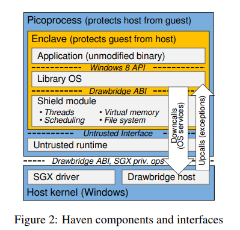
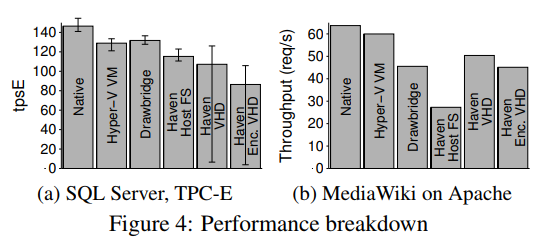
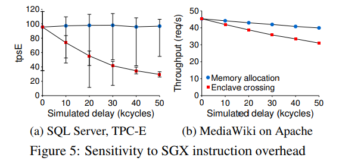

这篇文章全称《Shielding applications from an untrusted cloud with Haven》，是Microsoft在2014年发表在USENIX OSDI上的一篇文章，主要考虑的问题是云计算基础架构的安全性，云计算的用户希望云计算软硬件提供商能够保证数据的隐私及安全。这篇文章引入了shielded execution的概念，也就是屏蔽执行，能够保护程序和数据的运行平台的机密性和完整性，主要是云OS、虚拟机和firmware的安全，文章基于Windows设计了Haven原型，利用Intel的SGX的硬件保护来抵御内存探测等特权代码和物理攻击，这项工作促使了SGX规范的改进。

## 简介 & Introduction

现在的云计算系统使用传统的分层安全模型构建，目的是为了保护云提供商的特权代码不受不可信代码的影响，比如不被用户的虚拟机代码影响，但是缺点是不能够保护用户的数据被特权代码访问。目前保护隐私最好的方式是使用硬件安全模块HSM，支持一系列加功能，但是成本高，不通用。之前的相关研究是依赖可靠的VM管理程序来保护应用程序免受恶意OS的攻击，但无法防范受感染的虚拟机管理程序，另外通用计算的加密方案具有严重的性能限制。

本文提出Haven的目标是要在云环境中运行现有的服务器应用程序，并且保证运行的信任安全级别相当于用户直接在托管设施中操作自己的硬件，云提供商可以拒绝服务，但是不能观察或修改除了通过网络传输的任何用户数据，这也就是Haven中提出的屏蔽执行的意思。而云服务商保留对资源的控制，可以保证自己不恶意侵害。Haven实现了对未修改的Windows应用程序的屏蔽执行，利用了Intel的软件防护扩展(software guard extensions)，也就是SGX，SGX将进程实例化在一个隔离的安全地址空间区域，可以保护该区域代码的执行，并且可以防止恶意代码的攻击，这个安全区域称为enclave，飞地，翻译为被围起来的一部分。但是SGX执行模式由两个局限，一个是目标应用程序很大，会产生和处理异常，需要动态分配内存，并且可能执行任意x86指令，其次，运行的主机OS可能是恶意的。本文引入库操作系统LibOS来避免lago攻击，来源于Drawbridge，使用以小组资源，比如线程、虚拟内存和文件I/O来实现win8 的API，Haven和主机OS使用相互不信任的接口来实现这些源于，可以确保屏蔽执行未修改的应用程序，所以用户可以不必信任除云提供商、其软件或处理器之外的任何其它硬件就能获得端到端的安全保障。

这篇文章基于SGX的局限性提出了如下贡献：
* 提出来屏蔽执行，并描述了SGX如何支持它
* 提供了Haven，是第一个为商品OS实施二进制文件的屏蔽执行系统
* Haven使用如私有调度、不信任虚拟内存管理以及加密和完整性保护的文件系统等机制来屏蔽应用程序
* 用未修改的服务器应用程序如SQL Server和Apache来评估Haven的性能
* 确定了SGX的最低限度变化，以便对未修改的应用程序进行高效的屏蔽执行

## 安全研究概览
各种形式的孤立执行是可能的，软件实现依赖于可信的组件，比如实现隔离的管理程序。如果单独只用硬件实现的话，只有独立代码在可信计算库中，在很多种硬件隔离机制中，SGX是第一款允许程序间高效复用而不依赖可信软件的商用硬件。如果只是隔离的话并不能够保护应用程序，隔离机制还必须允许与不可信软硬件进行交互，用来交流结果或者访问系统服务。屏蔽执行是建立在隔离的机制上提供一种更高层次的安全特性，尤其是针对抽象程序能够保证如下特性：
* __保密性__： 屏蔽程序的执行系统只有输入和输出是可观察的，没有中间状态
* __完整性__： 除非选择不执行或者拒绝资源系统不会影响程序行为，程序完成后与参考平台的正确执行相同

本文作者师徒保护用户未修改的服务器应用程序的机密性和完整性，排除了基于软件的隔离机制，并且假设有一个强大的对手控制大部分提供商的硬件以及所有的软件，假设硬件层面的处理器是正确实现，并且安全。除了处理器的物理封装外，假定对手拥有其它包括内存和所有I/O设备的控制权。攻击者还控制整个软件堆栈，包括主机OS、管理程序、管理软件、平台固件、BIOS以及在系统管理模式下执行的代码和设备固件。还能够无限期的中断用户程序的执行，跨越隔离边界传递任意值等。

>作者设想了一个强大的对手，几乎控制了所有东西...

## 背景 & Background
本文实现的硬件层面的基础是Intel SGX，系统层面的基础是Drawbridge，关于Intel的SGX，主要是几个方面：内存保护、认证、飞地的进入和退出和动态内存分配。SGX保护用户模式地址空间区域中的页面的机密性和完整性，飞地数据受CPU访问控制（TLB）保护，但是当飞地的数据写进内存时是要加密和保护的，如果在内存中的数据被修改，随后的加载会报fault。可以用ECREATE指令创建飞地，SGX为每个飞地页面维护一个shadow状态，一旦创建了飞地，使用EADD添加内存页面，这些内存占用物理内存的特定区域：EPC，也就是嵌套页面缓存。在每个飞地页面被访问时，经过页表后，SGX确保处理器处于飞地模式。EPC是一种有限的资源，SGX通过将其内容分页到其它存储器来使得OS虚拟化EPC。SGX支持基于CPU的认证，使得远程系统能够以加密的方式来验证特定软件已经加载到飞地内部，并且创建了共享的秘钥，能够允许它引导该飞地端到端的加密通道。除了保护内存映射的内容和完整性之外，SGX还调节进入和离开飞地的过渡，并且保护飞地的寄存器文件不受OS异常处理程序的影响，这一点使用线程控制结构TCS进行管理。

可以说SGX是屏蔽执行的不完美的实现，因为OS的异常处理程序能够观察飞地的一些内部状态：异常向量，并且在页面错误的情况下能观察到访问类型和基地址。SGX不允许在创建后添加飞地页面，也不允许修改EPC的权限，这样不足以让Haven运行为修改的应用程序，但是新版本的SGX可以增删飞地页面和修改权限。

关于Drawbridge，Haven是基于其实现的，Drawbridge支持Windows应用程序的低开销沙盒，包括两个核心机制：picoprocess和LibOS。picoprocess是一个建立在硬件地址空间的安全隔离容器，并且不能访问传统的OS服务或系统调用，取而代之的是提供了一套用安全监控实现的OS ABI原语。这个ABI包括40个downcalls和3个upcalls，前者是请求包括虚拟内存、线程和I/O流等服务，后者是由主机初始化，只有输入没有返回，用作初始化、线程启动以及异常传递。另一个核心机制LibOS是Windows8重构后的一个版本，重构后用作picoprocess的一组库运行。Picprocess和LibOS一起支持对未经修改的Windows应用程序进行沙盒处理，具有与虚拟机相当的安全性，但大大降低了开销，虽然Drawbridge的目标只是为了保护主机免受不可信任的访客侵扰，但Haven屏蔽了应用程序和LibOS从不可信主机执行的情况，从而使主机和来宾之间相互不信任。

## 设计 & 实现

设计的话文章主要解决了两个方面的challenge，一个是保护不受恶意系统的侵害，以及在飞地执行二进制代码，恶意OS可能会利用应用程序潜在的bug来进行攻击，Haven的实现是利用飞地内的LibOS来限制恶意OS的发哪位，使用更狭窄的OS原语来实现完整的API，而libOS是在用户的控制之下，并且可以进行测试和检查。对于二进制代码的执行，它们在运行时加载代码和数据，在虚拟内存上动态分配和更改保护，执行任意用户模式指令（包括一些不受SGX支持的指令），引发和处理异常（例如页错误，零除或浮点异常），并使用线程进行本地存储。 Haven通过模拟不支持的指令，验证处理异常并改变LibOS的行为来限制二进制代码的执行。

文章实现屏蔽和不受信任的runtime，还通过编写驱动程序并对内核进行了一些修改，将SGX支持添加到host OS也就是Windows 8.1中，驱动程序实现了SGX内核模式的操作，包括分配和映射EPC页面、创建和销毁飞地。它受到主机的新人，但是不受区域代码的信任。作者还修改了主机内核以启用EPC页面到用户模式的有效映射，因为EPC区域对于内核来说是保留的设备空间，现有的用于将设备内存映射到用户模式的驱动程序API没有有效的页面细化映射和保护更改。并且作者还实现了使用SGX调试机制来调试飞地的支持，对LibOS进行了修改，来避免在picoprocess中使用SGX不支持的共享内存。

## 性能评估
作者利用Intel为SGX提供的一个使用的模拟器来建立并测试Haven，但是因为没有SGX CPU或者cycle精确的模拟器，作者自己建立了一个性能模型来衡量Haven对关键SGX性能参数的敏感度。为了对性能进行建模，作者假定除了SGX指令和异步退出的额外成本之外，SGX实现将与CPU执行相同的操作。许多SGX指令仅在安全区启动时执行，因此与长期运行的服务器应用程序性能无关。作者还假设EPC足够大以容纳应用程序的工作集，这样就不会模拟其它开销，SGX上Haven性能的唯一剩余直接开销就是动态内存分配以及转换进入和离开飞地模式的指令。EPC访问的内存penalty难以建模，作者通过人工降低DRAM频率的方式来模拟较慢EPC的影响。

作者使用的负载程序包括数据库和web服务器，数据库使用Microsoft SQL 2014 企业版，还有TPC-E，这是一个标准的线上事务处理benchmark，每次运行都允许至少30分钟的启动热身warm-up，并且每隔一个小时测量一次transaction的性能，报告吞吐量。Web服务器使用Apache的http服务器和PHP。在客户端使用50个工作线程来不断的请求获取主页。

如上为作者实验的性能评估结果，作者将Haven的性能与各种主机环境进行比较，并分别采用不同的配置进行性能比较，比如一种是信任主机实现文件系统，另一种是配置私有的文件系统，但不加密，最后是采用了vhd加密和完整性保护的完整系统。作者验证了服务器的CPU是所有非Haven运行中的瓶颈，而不是网络或存储I/O。

作者的实验结果表明对于大型复杂的CPU密集和内存密集型的应用程序以及OS密集型应用程序，比如SQL Server和现代的Web堆栈，即使Haven的原型效率低下，性能损失在31%到54%，可能仍然会有很多永远愿意接收这种开销来换取不需要信赖云才能得到安全。

## 讨论及相关工作

作者对包括SGX优化在内的各种问题进行了讨论，包括可信计算基础、SGX优化中的异常处理、存储回滚以及云管理等。另外还讨论了屏蔽执行的硬件支持，包括屏蔽的VM以及没有信息泄露的屏蔽，另外还有一些相关工作包括可信硬件、云安全以及从不可信OS屏蔽应用等介绍。

最后得到结论是当今的云平台提供了很多优点，但这些优点超过了分层安全体系固有的风险，就是云提供商可以完全访问用户的数据，为了消除这种风险，Haven可以在未受信任的云主机中实施未经修改的服务器应用程序的屏蔽执行。Haven使得云计算想真正的效用计算又前进了异步，可以保证使用程序提供资源，比如处理器、存储和网络，但是又可以确保他们不会访问用户数据。
